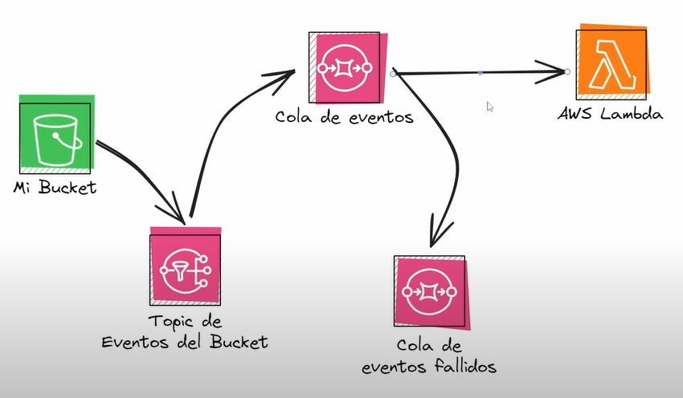

# AWS SNS SQS

File upload to S3 bucket using SNS topic, SQS queues and lambda function.

## Useful commands

* `npm run build`   compile typescript to js
* `npm run watch`   watch for changes and compile
* `npm run test`    perform the jest unit tests
* `cdk deploy`      deploy this stack to your default AWS account/region
* `cdk diff`        compare deployed stack with current state
* `cdk synth`       emits the synthesized CloudFormation template

## Upload file to S3 bucket

`aws s3 cp example.txt s3://aws-sqs-sns-bucket`

## AWS diagram

